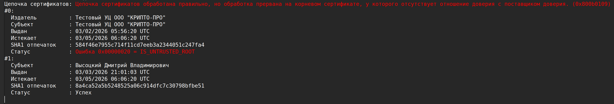

# Первый этап установка крипто про:

ссылка на иструкцию установки:

Примечание!!!
Для удобства пользования Крипто Про я в ~/.bashrc добавил каталоги КриптоПро в переменную окружения PATH (чтобы пользоваться инструментами как утилитами, а не скриптами):
export PATH="/opt/cprocsp/bin/amd64:/opt/cprocsp/sbin/amd64:$PATH" 

Примечание!!!
GUI "Инструменты Крипто Про" отстают от терминала. Перезапускайте GUI для отображения актуальной информации.

Обзор на основные иструменты:
cpconfig - 
cryptcp - Утилита командной строки для подписи и шифрования файлов.
certmgr - Менеджер сертификатов.
csptest -
cpverify -

Каталог где хранятся ключи, информация о пользователях и т.д. : 
/var/opt/cprocsp/

# Второй этап установка сертификатов УЦ:

Зачем нужны сертификаты УЦ?
Чтобы система знала сертификатам какого УЦ доверять.

Ссылка на скачивание корневого сертификата Тестового УЦ Крипто Про (выбирать Base64) - https://testgost2012.cryptopro.ru/certsrv/certcarc.asp
Промежуточного сертификата там нет даже в цепочке сертификатов.

!!! Примечание ссылки на сертификаты Тестового УЦ Крипто Про в случае, если получать публичный сайт вы захотите через сайт.
Ссылка на скачивание корневого сертивиката Тестового УЦ Крипто Про - http://testca2012.cryptopro.ru/cert/rootca.cer
Ссылка на скачивание промежуточного сертификата Тестового УЦ Крипто Про - http://testca2012.cryptopro.ru/cert/subca.cer

команда для установки сертификата для текущего пользователя: certmgr -install -store u<название хранилища> -file <путь к сертификату>
команда для установки сертификата на компьютер: certmgr -install -store m<название хранилища> -file <путь к сертификату>

| Английское имя            | Куда можно установить  | Русское название в интерфейсе                               |
| ------------------------- | ---------------------- | ----------------------------------------------------------- |
| **my**                    | Default                | **Личное**                                                  |
| **root**                  | Default / LocalMachine | **Доверенные корневые центры сертификации**                 |
| **ca**                    | Default / LocalMachine | **Промежуточные центры сертификации**                       |
| **addressbook**           | Default / LocalMachine | **Другие пользователи**                                     |
| **cache**                 | Default                | **Кэш**                                                     |
| **request**               | Default                | **Запросы заявок на сертификат**                            |
| **cryptoprotrustedstore** | Default / LocalMachine | **Доверенные корневые сертификаты КриптоПро CSP**           |
| **disallowed**            | Default / LocalMachine | **Недоверенные сертификаты** (обычно скрыто, но существует) |

# Третий этап создание ключевого контейнера:

Для корректной работы с ЭП нужно иметь закрытый и открытый ключ, но они должны где-то храниться. Для этого и нужен ключевой контейнер.

Команда для создания ключевого контейнера: csptest -keyset -newkeyset -container '\\.\HDIMAGE\имя  будующего контейнера'

Примечания к команде!!!
1) поумолчанию тип критопровайдера при создании ключевой пары стоит Crypto-Pro GOST R 34.10-2012 Cryptographic Service Provider, поэтому в команде не обязательно прописывать -provtype 80
2) поумолчанию в ключевой контейнер ставится два секретных ключа signature и exchange, чтобы это поменять надо использовать -keytype <type>

Примечания по ключам и виды считывателей!!!
1) виды ключей: signature key - ключ подписи; exchange key - ключ обмена; symmetric key - ключ cимметричный
2) предназначение ключей: 
    signature key – используется для создания электронной подписи, подтверждает авторство и целостность документа.
    exchange key – используется для шифрования/расшифровки данных при обмене информацией с другими пользователями.
    symmetric key – применяется для быстрого шифрования больших объёмов данных между доверенными сторонами, где и отправитель, и получатель используют один и тот же ключ.
3) команда для просмотра считывателей: cpconfig -hardware reader -view

# Четвертый этап создание запроса на выпуск публичного сертификата от УЦ:

Чтобы наша ЭП считалась квалифицированной нужно получить публичный сертификат от УЦ. Для этого сначала создадим заявку.

Команда для создания заявки: cryptcp -creatrqst -dn 'CN=dmitryvysotskiy,E=cas@altlinux.org' -nokeygen -cont '\\.\HDIMAGE\<имя контейнера>' <имя файла заявки>.csr -base64

!!! Примечание: -base64 обязательно, чтобы потом не пришлось переводить файл <имя файла заявки>.csr в читаемый формат.

!!! Примечание: -base64 обязательно, чтобы потом не пришлось переводить файл <имя файла заявки>.csr в читаемый формат.

!!!Примечание по заполнению dn (разделитель запятая; при ошибке ErrorCode: 0x80092023 используйте OID, а не алиас):
| OID | Алиас | Назначение | Примечание |
|-----|-------|------------|------------|
| 2.5.4.3 | CN | Общее имя | Наименование ЮЛ (если ИНН начинается с "00") или ФИО владельца. Длина не более 64 символов |
| 2.5.4.4 | SN | Фамилия |  |
| 2.5.4.42 | GN/G | Имя Отчество | Общая длина текста в полях SN и G должна быть не более 64 символов (с учетом одного пробела между текстом из Фамилии и текстом из Имени) |
| 1.2.840.113549.1.9.1 | emailAddress/E | Адрес электронной почты | ivanov@mail.mail |
| 1.2.643.100.3 | SNILS | СНИЛС | Должно быть записано 11 цифр (допускается 11 нулей для иностранных граждан) |
| 1.2.643.3.131.1.1 | INN | ИНН | 12 цифр, для ЮЛ первые две цифры 00 |
| 2.5.4.6 | C | Страна | Двухсимвольный код страны (RU) |
| 2.5.4.8 | S | Регион | Наименование субъекта РФ ЮЛ: по адресу местонахождения, ФЛ: по адресу регистрации (39 Калининградская обл.) |
| 2.5.4.7 | L | Населенный пункт | Наименование населенного пункта (Калининград) |
| 2.5.4.9 | street | Название улицы, номер дома | Пр-т Победы 14 кв.3 |
| 2.5.4.10 | O | Организация | Полное или сокращенное наименование организации (только для ЮЛ) |
| 2.5.4.11 | OU | Подразделение | В случае выпуска СКПЭП на должностное лицо – соответствующее подразделение организации (только для ЮЛ) |
| 2.5.4.12 | T | Должность | В случае выпуска СКПЭП на должностное лицо – его должность (только для ЮЛ) |
| 1.2.643.100.1 | OGRN | ОГРН | ОГРН организации (только для ЮЛ) |

# Пятый этап получение публичного сертификата от УЦ

1) Открываем созданный файл <имя файла заявки>.csr в любом текстовом редакторе и удаляем -----BEGIN CERTIFICATE----- в начале и -----ENDCERTIFICATE----- в конце.
2) Копируем оставшееся содержимое.
3) Переходим по ссылке https://testgost2012.cryptopro.ru/certsrv/certrqxt.asp и в окно "Сохраненный запрос:" вставляем содержимое буффера обмена.
4) Нажать на кнопку "выдать".
5) Выбираем формат "Base-64" и жмем "Загрузить сертификат".

Сертификат получен!!!

Примечание!!!
Сертификат можно создать и зарегестрировавшись на сайте: http://testca2012.cryptopro.ru/ui/ . Гайд на выпуск сертификата с помощью сайта можно найти здесь: https://docs.crpt.ru/gismt/Инструкция_по_созданию_тестовой_подписи/

# Шестой этап добавляем полученный от УЦ сертификат.

Теперь нужно поместить полученный от УЦ сертификат в ключевой контейнер и потом его же добавить в Личные сертификаты.

комада для добавления в контейнер: cryptcp -instcert -cont '\\.\HDIMAGE\<имя контейнера>' -ku Downloads/certnew.cer
команда для добавления в Личные сертификаты: certmgr -inst -file <имя сертификата>.cer -store uMy

# Теперь можно подписывать и шифровать файлы!!!

## Полезные команды:

вывод списка хранилищ сертификатов:
certmgr -enumstores <аргумент>

Настройка криптопровайдера по умолчанию

Для просмотра типов доступных криптопровайдеров:
cpconfig -defprov -view_type

Для просмотра свойств криптопровайдера нужного типа:
cpconfig -defprov -view -provtype <provtype>

Для установки провайдера по умолчанию для нужного типа:
cpconfig -defprov -setdef -provtype <provtype> -provname <provname>

Для получения имени провайдера по умолчанию для нужного типа:
cpconfig -defprov -getdef -provtype <provtype>

для просмотра списка настроенных ДСЧ (ДСЧ — датчик случайных чисел):
cpconfig -hardware rndm -view

проверить информацию о ключевом контейнере:
csptest -keyset -check -cont '\\.\HDIMAGE\имя контейнера'

создание контейнера с ключами (-provtype 80 ГОСТ 34.10-2012): 
csptest -keyset -provtype <номер нужного провайдера> -newkeyset -cont '\\.\HDIMAGE\имя контейнера'             

вывод списка контейнеров: 
csptest -keyset -enum_cont -fqcn -verifyc 

удалить контейнер: 
csptest -keyset -deletekeyset -cont '\\.\HDIMAGE\имя контейнера' 